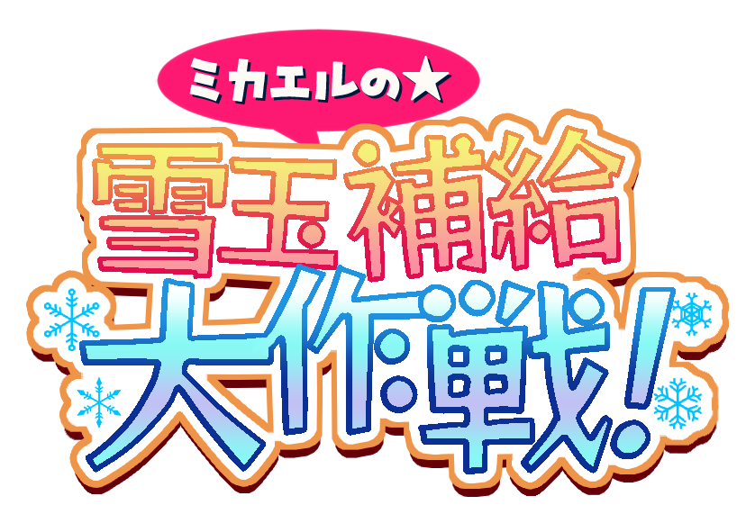
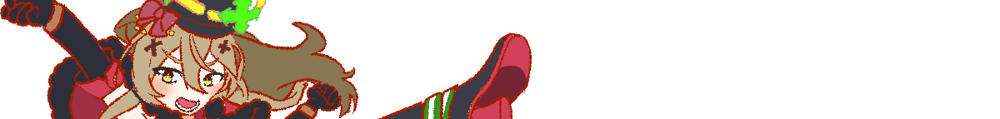

# ミカエルの雪玉補給大作戦

このリポジトリは、ワンダープラネット株式会社が主催するクラッシュフィーバーの二次創作コンテストである[「もうすぐ９周年！クラファーコンテスト」](https://crashfever.com/campaign/2024043036871/)に応募するためのゲームプロジェクトです。ゲームはPhaser 3.80を使用して開発され、公開はGitHub Pagesを通じて行います。

[プレイはこちらから](https://kumoridai.github.io/michael_snowball_supply_operation/)

## ゲーム内容

### 世界観

2023年のクリスマスイベント **「祝福収集☆天使と悪魔の雪合戦！」** において、本編に登場しなかったミカエルが、天使チーム「エンジェリック・シャイニーレッド」の雪玉補給係だったのではないか？ という妄想を形にしたゲームです。

プレイヤーはミカエルになり、天使チームに所属します。
たくさん雪玉を作って天使チームの勝利を目指し、雪合戦を盛り上げましょう。

 頼むわよ！ ＞  

---

### 操作方法

- マウス操作もしくはタッチ操作のみ使用します。
- 雪玉製作フェーズでは、長押ししてタイミング良く離すことで、雪玉を作ります。
- 雪合戦フェーズでは、画面を左右にスワイプし、飛んでくる雪玉を避けます。

### ゲームの流れ

#### 雪玉製作フェーズ

- 雪合戦の準備パートです。
- 画面を長押ししてタイミングよく離すことで、天使AIたちが要求する大きさの雪玉を作成しましょう。
- 1つまで雪玉を自動でキープできます。
- 雪玉を作っている間はミカエルの手がかじかんでいき、雪玉を作るのが遅くなっていきます。
- 作った雪玉は、この後の雪合戦フェーズで天使AIたちが使います。
- たくさん作成して、雪合戦を有利に進めて盛り上げましょう！

#### 雪合戦フェーズ

- 天使AIと悪魔AIたちの雪合戦が始まります。
- ミカエルはあくまで補給係。飛んでくる雪玉を避けることに専念しましょう。
- 味方の投げた雪玉が相手に当たり、雪合戦が盛り上がると、神雪の杯にクリスマスパワーが溜まっていきます。
- 雪合戦の時間が終わったときに、神雪の杯がいっぱいになっていたらゲーム終了です。
- 溜めたクリスマスパワーが多いチームの勝利となります。
- 天使チームで貯めたクリスマスパワーがゲームのスコアになります。X(Twitter)にシェアして競えます。

### 小ネタ

- 雪玉を当てられたときの怯みやすさ、動きの速さ、投げるペースなど微妙にキャラ差があります。
- ウリエルは容赦なくサンダルフォンの後頭部に雪玉をぶつけます（クリスマスイベントのtipsを参考）。
- フォルネウスはミカエルを狙うサメを飛ばしてきます。雪玉が尽きそうになるとペースが上がります。
- クリスマスパワーが溜まりきっていなかったら、二周目に入ります。ハイスコアを狙うなら、スコア調整が重要かも……？

---

## プロジェクトの概要

このゲームは、クラッシュフィーバーのキャラクターや設定を基にした二次創作です。
Phaserフレームワーク（MITライセンス）およびCorporate-Logo-Rounded-Bold-ver3フォント（SIL Open Font License 1.1）を使用しています。
その他の全てのファイルは自作し、クラッシュフィーバーの登場キャラクターについては応募規約に基づき一部模写を行なっています。

### 使用ライブラリおよびフォントのライセンス

- **Phaser3**: MITライセンスに基づいて使用しています。
- **Corporate-Logo-Rounded-Bold-ver3**: SIL Open Font License 1.1に基づいて使用しています。
本リポジトリ内のこれらのファイルは、該当のライセンスを引き継ぎます。

### ライセンス

このプロジェクトは、ワンダープラネット株式会社が主催する「もうすぐ９周年！クラファーコンテスト」への応募作品として作成されました。
本リポジトリの内容は、個人的な学習および評価のためにのみ使用することが許可され、商業的利用、再配布、改変、二次利用は固く禁じます（ワンダープラネット株式会社によるものを除く）。

また、後述するコンテストの応募規約に基づき、このライセンスはコンテストの結果発表後に変更する可能性があります。

### コントリビューションおよびIssueについて

本プロジェクトはコンテスト応募用であるため、機能の追加や修正の提案、Issueの受付は行っておりません。予めご了承ください。

### 応募規約に基づくライセンスの変更可能性について

このゲームは、「もうすぐ９周年！クラファーコンテスト」に応募するために開発されました。以下の応募規約に基づき、応募時点では二次利用を禁止し、提案やIssueの受付を行いませんが、コンテストの結果発表後にこれらを変更する可能性があります。

>- 応募作品は、応募者本人がデザイン・作成した未公表の作品に限ります。
>- 応募作品が当選した場合、著作権およびその他の権利はクラッシュフィーバーの運営会社に譲渡されます。

### 問い合わせ先

X(Twitter): [@kumoridai](https://x.com/kumoridai)

---

このプロジェクトは、クラッシュフィーバーの二次創作コンテストのために作成されました。皆様の応援とフィードバックをお待ちしております！
